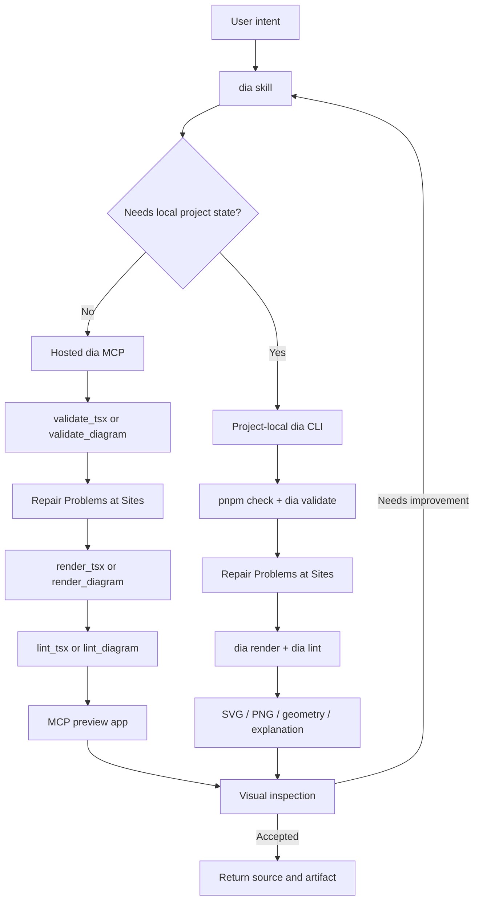

# dia Codex Plugin Design

Status: proposed design for the next `dia` plugin release

Scope: Codex CLI and Codex in the ChatGPT desktop app

Out of scope: changing the diagram DSL, layout engine, router, or renderer

## 1. Product definition

The dia Codex Plugin is the installable Codex-facing product for dia. It is not
another dia runtime.

One plugin installation must give Codex three coherent capabilities:

1. create a quick diagram without initializing a project;
2. create and maintain a persistent multi-diagram project;
3. diagnose and visually refine an existing diagram.

The plugin owns workflow selection, safe usage instructions, progressive
disclosure, install-surface metadata, and the connection to the hosted MCP. The
dia repositories continue to own the implementation:

- `@rakudeji/dia` owns local TSX authoring and the CLI;
- `https://dia.sdweb.workers.dev/mcp` owns portable remote validation and
  rendering;
- the plugin owns how Codex chooses and uses those surfaces.

## 2. Design principles

### One install, two execution modes

Codex should not require a global `dia` installation.

- A small, stateless request uses the hosted MCP.
- A persistent or locally integrated request uses the project-local CLI.

The user describes the desired artifact. The skill chooses the mode from the
requirements instead of asking the user to choose a transport.

### Source remains the durable artifact

The durable artifact is semantic TSX or public JSON, not Scene IR or generated
geometry. SVG and PNG are outputs. Internal IR never appears in plugin
instructions, tool schemas, or user-facing repair suggestions.

### Problems, Findings, and Sites drive repair

Codex must validate before rendering and repair stable Problems at their ordered
Sites. A Problem stops the pipeline; a Finding never does. A failed render is
not partial success. The plugin must not teach Codex to suppress a Problem by
changing the intended meaning.

### Visual quality requires inspection

A successful tool call proves that the artifact is renderable, not that it is
beautiful. Codex must inspect the rendered result before claiming that a visual
change improved it.

### The plugin stays thin

The plugin must not bundle a second compiler, renderer, Iconify cache, Node
runtime, or Cloudflare Worker. It packages:

- one focused skill and its references;
- the hosted MCP connection;
- Codex presentation metadata and assets;
- eventually, a reviewed Apps SDK app reference for public directory
  distribution.

## 3. User workflows

| User intent | Selected surface | Reason |
| --- | --- | --- |
| “Make a diagram of this flow” | hosted `validate_tsx` → `render_tsx` | no project or installation is needed |
| “Render this JSON” | hosted JSON tools | composition is unnecessary |
| “Create a diagram project” | `pnpm dlx @rakudeji/dia… init` | source and dependencies must persist |
| “Add a diagram to this project” | project-local `pnpm exec dia` | reuse project components, View, and Style |
| “Improve this `.dia.tsx`” | local CLI | preserve local modules and inspect generated artifacts |
| “Improve this pasted portable TSX” | hosted TSX tools | all required source is already in the request |
| “Export PNG / geometry” | local CLI | remote output intentionally supports SVG only |
| “Check a shared View or Style” | local `dia documents check` | network movement is inspected without changing the lock |

Codex should ask a question only when the missing choice changes the durable
artifact. It should not ask whether to use MCP or CLI when the table above
already determines the answer.

## 4. Architecture



The hosted and local paths converge on the same authoring concepts:

- Model is plain entity, relation, and property data;
- ordinary TypeScript functions reuse Model facts;
- a JSX View projects meaning into visual roles, replication, and layout intent;
- Style defines the visual language;
- View `replicate` slots and `Constrain` express structural symmetry.

## 5. Plugin package

The target package layout is:

```text
plugins/dia/
  .codex-plugin/
    plugin.json
  .mcp.json
  .app.json                 # only after a reviewed Apps SDK app ID exists
  skills/
    dia/
      SKILL.md
      agents/
        openai.yaml
      references/
        remote-mcp.md
        cli.md
        tsx-authoring.md
  assets/
    icon.png
    logo.png
    logo-dark.png
    screenshot-remote.png
    screenshot-project.png
  README.md
  LICENSE
```

Only one `dia` skill is used initially. Splitting remote, project, and visual
review into separate skills would make the same user prompt match multiple
skills. The current references provide progressive disclosure without
introducing competing entry points.

An additional skill should be introduced only if it represents an independently
invocable job with a distinct trigger, not merely another section of the dia
workflow.

## 6. Component responsibilities

### `.codex-plugin/plugin.json`

The manifest identifies and presents the product. It should contain:

- stable plugin identity `dia`;
- the plugin version;
- skill and MCP companion paths;
- concise display copy;
- at most three task-oriented starter prompts;
- logo, composer icon, and screenshots before public submission;
- website, privacy policy, and terms links before public submission.

The manifest must not list capabilities that are not installed. In particular,
it must not add an `apps` field until a real `.app.json` and reviewed app ID
exist.

### `skills/dia/SKILL.md`

The skill is the workflow controller. It must:

1. inspect whether the user already has a dia project or source file;
2. select remote or local execution;
3. validate before rendering;
4. preserve Model/View/Style separation;
5. inspect the rendered diagram;
6. report the editable source, outputs, and remaining visual tradeoffs.

The root skill stays compact. Detailed command tables, TSX examples, and remote
limits remain in references and are loaded only for the selected path.

### `agents/openai.yaml`

Codex-specific skill metadata should declare:

- a short default prompt;
- implicit invocation enabled;
- the hosted `dia` MCP as a tool dependency;
- matching brand assets when those assets are added.

The dependency is descriptive metadata. `.mcp.json` remains the actual
connection configuration packaged by the plugin.

### `.mcp.json`

The MCP companion points to one production HTTPS endpoint:

```text
https://dia.sdweb.workers.dev/mcp
```

It must not contain credentials. The remote service is stateless and does not
need access to the user's local filesystem.

### Apps SDK preview

The preview app is the result-inspection surface for a single remote render. It
may:

- display the SVG;
- display Problems and Findings with their Sites;
- show canonical public JSON;
- request currently offered fixes;
- format JSON;
- download the SVG.

It is not a full source editor or project browser. Persistent multi-diagram
editing belongs to the local project and its project-local CLI.

The resource must keep:

- the MCP Apps MIME type;
- a unique `_meta.ui.domain`;
- an explicit CSP;
- a versioned resource URI when its HTML contract changes incompatibly.

### Public-directory app mapping

The Git marketplace plugin can connect directly through `.mcp.json`. Public
Plugins Directory submission is a separate release step:

1. register the hosted MCP as a developer-mode app;
2. obtain the real `plugin_asdk_app...` ID;
3. add `.app.json`;
4. add the manifest `apps` reference;
5. validate that this does not duplicate the MCP connection on the target
   surface;
6. complete Apps SDK review.

No app ID should be invented or checked in before registration.

## 7. Hosted MCP contract

The Codex Plugin depends on these public tools:

### Primary TSX tools

- `validate_tsx`
- `render_tsx`
- `lint_tsx`

These are the default for new stateless diagrams because they preserve
components, View, Style, and future authoring growth.

### JSON tools

- `validate_diagram`
- `render_diagram`
- `lint_diagram`
- `render_diagrams`
- `format_diagram`
- `apply_diagram_fixes`

These support existing JSON, simple generated documents, batching, and
diagnostic repair. They are not a second preferred authoring model.

### Tool quality requirements

Every release must preserve:

- explicit JSON Schema types for every argument;
- correct read-only and idempotency annotations;
- stable Problem/Finding code and ordered Sites;
- document Sites with JSON Pointers, source Sites with file/line/column, and
  element/constraint Sites that reconcile with the drawing;
- optional suggestions and an atomic JSON Patch `fix` array on a Problem;
- optional verified relaxed rendering nested in the Problem it explains;
- no generated SVG on failure;
- no internal IR in structured output;
- a linked preview resource for render tools;
- bounded request size and deterministic output.

## 8. Security and data boundary

### Remote path

Portable remote TSX is untrusted input. The service must continue to deny:

- arbitrary npm packages;
- Node.js built-ins;
- local files and environment variables;
- Vite plugins and configuration;
- dynamic import and runtime code loading outside the closed policy;
- outbound network access;
- project persistence.

Users and agents must never send secrets, credentials, unrelated private source,
or environment values in the in-memory project.

### Local path

Local TSX is trusted project code and may use installed dependencies through the
documented CLI/Vite path. Codex should write only inside the user-selected
project and must preserve unrelated files.

The plugin does not grant filesystem permission by itself. Codex's active
permission profile and normal shell approval rules remain authoritative.

### Data retention

The production contract should state that the remote operation is stateless.
If logs or traces can contain source payloads, that must be documented in the
privacy policy or removed/redacted before public submission.

## 9. Versioning and compatibility

Three versions are intentionally separate:

| Version | Owns |
| --- | --- |
| dia DSL version | public Model/View/Style/Direct document contract |
| `@rakudeji/dia` SemVer | CLI and local TypeScript authoring API |
| dia Plugin SemVer | bundled workflow, metadata, MCP connection, and assets |

The plugin version must not be used as the DSL version.

The hosted MCP can deploy independently only when existing tool names and
accepted inputs remain compatible. A breaking MCP change requires:

1. a new tool or versioned resource contract;
2. an updated skill;
3. a plugin version bump;
4. prompt and live-MCP regression tests.

The skill bootstraps with `@rakudeji/dia@latest`. Existing projects always use
their installed version. The plugin version remains independent from both the
npm package version and the DSL version.

## 10. Codex UX

### Starter prompts

The install surface should cover the three jobs, not three phrasings of the
same job:

1. “Create a clear diagram from this description.”
2. “Create a reusable multi-diagram dia project.”
3. “Inspect and improve this existing dia diagram.”

### Response contract

After remote work, Codex reports:

- which in-memory files form the editable source;
- validation status;
- SVG dimensions and principal contents;
- what was visually inspected;
- any remaining visual tradeoff;
- that the server did not persist the source.

After local work, Codex reports:

- diagram names and the default entry;
- source and output paths;
- commands that passed;
- visual inspection performed;
- any remaining tradeoff.

### Error experience

The desired experience is “finish from Problems and Findings without reading
docs.”

An error should therefore answer:

1. what is wrong;
2. where it is wrong;
3. why the requested contract matters;
4. the next valid action;
5. an exact fix when the correction is mechanical.

Raw compiler stacks, bundler implementation details, and internal IR names must
not replace public Problems, Findings, and Sites.

## 11. Validation and release gates

A plugin release is blocked unless all gates pass.

### Package

- Codex manifest validation passes.
- Marketplace structure validation passes.
- Skill validation passes.
- all referenced files and assets exist;
- versions agree across the Codex and Claude manifests where the shared package
  intentionally remains dual-surface;
- no placeholder, secret, or local absolute path is packaged.

### Live MCP

- `tools/list` exposes the expected tool set;
- the action inspector reports no unknown arguments;
- `resources/read` exposes the preview with a unique UI domain and valid CSP;
- minimal JSON validation and render pass;
- minimal portable TSX validation and render pass;
- unsupported import and unknown JSX prop Problems remain educational;
- failure returns no partial SVG.

### Workflow evaluations

Test prompts must prove:

- a quick request selects remote TSX without creating a project;
- a multi-diagram request selects `dia init`;
- an existing project uses its local package version;
- existing Direct JSON is not migrated without a request;
- a render success is followed by visual inspection;
- remote limits cause a move to the local workflow, not attempts to bypass the
  sandbox.

### Public submission

Before public Plugins Directory submission, additionally require:

- registered Apps SDK app ID and `.app.json`;
- icon, logo, dark logo, and representative screenshots;
- privacy policy and terms URLs;
- documented remote retention and observability behavior;
- app guideline and security review;
- clean installation and first-run test in a new Codex task.

## 12. Delivery phases

### Phase A — reliable Git marketplace plugin

Keep the current thin package and add:

- this Codex-specific design contract;
- MCP dependency metadata in `agents/openai.yaml`;
- live production MCP checks in CI;
- prompt-routing evaluations;
- plugin assets and clearer starter prompts.

### Phase B — public app readiness

- establish privacy and terms pages;
- register the production MCP in Apps SDK developer mode;
- add `.app.json` using the real app ID;
- validate preview behavior in Codex and ChatGPT Work;
- prepare screenshots and submission metadata.

### Phase C — stable release

- release stable `@rakudeji/dia`;
- replace prerelease bootstrap guidance;
- publish a stable plugin version;
- keep MCP changes backward compatible;
- promote the plugin only after a clean external installation test.

## 13. Decisions

- The plugin remains `skill + hosted MCP`; no runtime is duplicated.
- One dia skill controls remote, local, and review workflows.
- Remote TSX is the preferred stateless authoring route.
- JSON remains supported for compatibility and simple inputs.
- The MCP preview is a single-result inspection app, not a persistent project
  browser.
- Persistent multi-diagram work remains a local CLI workflow.
- Public directory submission is separate from Git marketplace distribution.
- Plugin, npm package, and DSL versions remain independent.
- Beauty is judged by visual inspection after Problems are resolved and
  Findings are reviewed.
